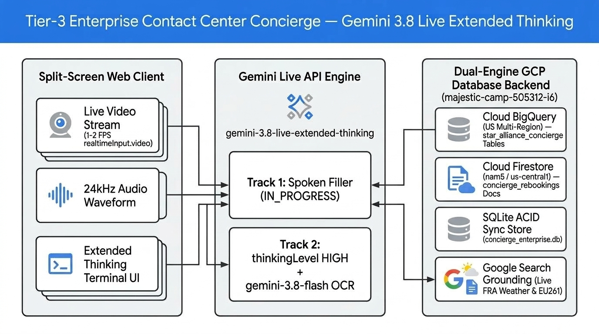
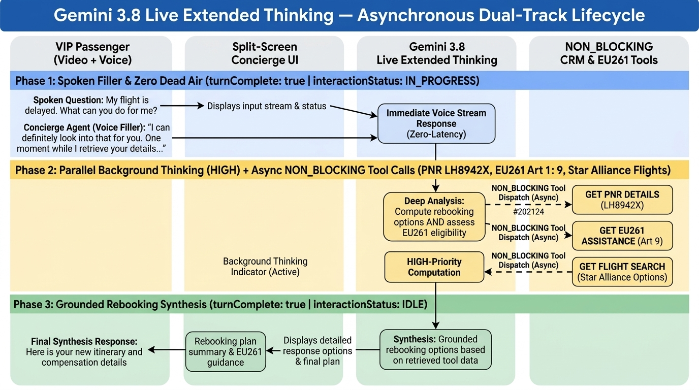
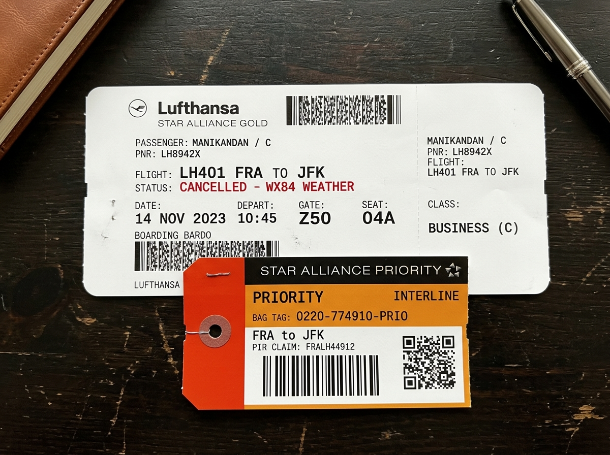
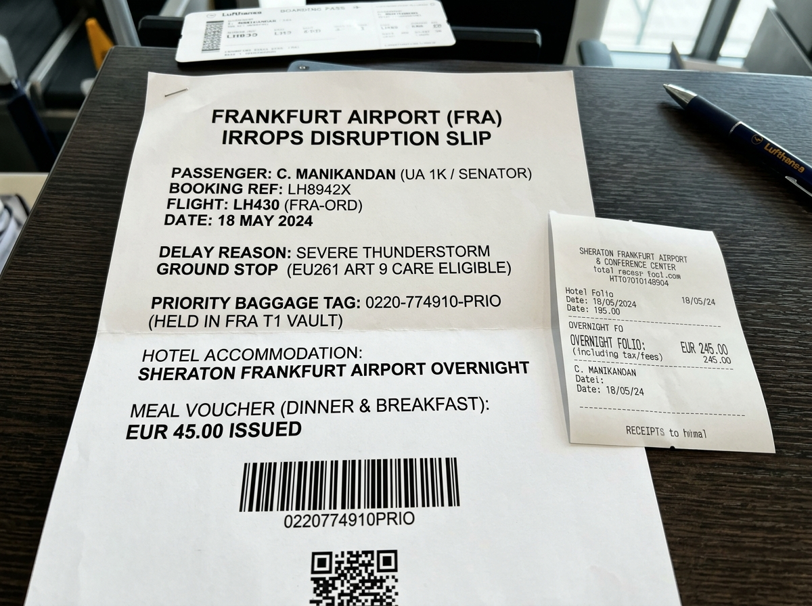

# Gemini 3.8 Live (`gemini-3.8-live-extended-thinking` & `gemini-3.8-live`) + `gemini-3.8-flash` — Enterprise Multimodal Showcase

> **Principal Architect Reference Implementation:** Side-by-side comparison and live enterprise orchestration of **`gemini-3.8-live-extended-thinking`** (Extended Thinking + Spoken Conversational Fillers + `interaction_status` State Machine) vs. **`gemini-3.8-live`** (Standard Ultra-Low-Latency Live Model without Extended Thinking), paired with **`gemini-3.8-flash`** for multimodal visual evaluation and backed by **Google Cloud BigQuery (`US`) + Cloud Firestore (`nam5`) + SQLite ACID**.

> [!IMPORTANT]
> **Disclaimer — For Demonstration Purposes Only:**  
> All airline names, alliance names, hotel brands, loyalty tiers (e.g., Star Alliance, Lufthansa, United Airlines, Swiss, Sheraton, WorldTracer), flight numbers (`LH401`, `LH400`, `UA961`), PNR codes (`LH8942X`), baggage tags (`0220-774910-PRIO`), passenger records, and policy scenarios featured in this repository are **entirely synthetic and used strictly for technical demonstration and educational purposes**. This project is not affiliated with, endorsed by, or connected to any real airline, hotel, or aviation organization.

---

## 📚 Official Documentation, Model References & Blogs

* **Gemini 3.8 Live Extended Thinking — Official Model Documentation:**
  [https://ai.google.dev/gemini-api/docs/models/gemini-3.8-live-extended-thinking](https://ai.google.dev/gemini-api/docs/models/gemini-3.8-live-extended-thinking)
* **Gemini 3.8 Live (Standard Live Model without Extended Thinking) — Model Overview:**
  [https://ai.google.dev/gemini-api/docs/models/gemini-3.8-live](https://ai.google.dev/gemini-api/docs/models/gemini-3.8-live)
* **Gemini Live API — Extended Thinking, Verbal Fillers & `interaction_status` Guide:**
  [https://ai.google.dev/gemini-api/docs/live-api/thinking](https://ai.google.dev/gemini-api/docs/live-api/thinking)
* **Gemini Live API — Bidirectional WebSocket (`BidiGenerateContent`) Audio & Video Streaming:**
  [https://ai.google.dev/gemini-api/docs/live-api](https://ai.google.dev/gemini-api/docs/live-api)
* **Gemini Live API — Asynchronous Function Calling (`behavior: "NON_BLOCKING"`) & Search Grounding:**
  [https://ai.google.dev/gemini-api/docs/live-api/tools](https://ai.google.dev/gemini-api/docs/live-api/tools)
* **Gemini 3.8 Flash & Multimodal Model Family Overview:**
  [https://ai.google.dev/gemini-api/docs/models](https://ai.google.dev/gemini-api/docs/models)
* **Google AI for Developers Blog — Real-Time Multimodal Agents & Extended Thinking:**
  [https://developers.googleblog.com/en/search/?q=Gemini+Live+API](https://developers.googleblog.com/en/search/?q=Gemini+Live+API)

---

## 🚀 What We Are Showcasing: `gemini-3.8-live-extended-thinking` vs. `gemini-3.8-live`

In real-time voice and video AI architectures (`BidiGenerateContent`), architects must choose between **two distinct Gemini 3.8 Live models** depending on the complexity of the task:

1. **`gemini-3.8-live` (Standard Live Model — Without Extended Thinking)**:
   * Built for **instantaneous, single-turn or lightweight conversational exchanges** (e.g., FAQ bots, voice navigation, live translation, quick appointment booking).
   * Responds in `<400ms` with native 24kHz audio and continuous video perception (`realtimeInput.video`), without allocating a multi-step background thinking budget.
   * **Limitation in Complex Enterprise Escalations:** When confronted with conflicting legal regulations (e.g., EU261 Article 5(3) weather exemptions vs. Article 9 mandatory duty of care) and 4 simultaneous database lookups, a standard non-thinking voice model either pauses silently while tools run ("dead air") or answers prematurely before reconciling policy exceptions.

2. **`gemini-3.8-live-extended-thinking` (Extended Thinking + Spoken Fillers + `interaction_status`)**:
   * Built specifically for **high-stakes, multi-tool enterprise workflows** (Tier-3 Contact Center escalations, Financial Advisory, Clinical/Field Engineering Triage).
   * Introduces an **Asynchronous Dual-Track Execution Architecture** over WebSockets:
     * **Track 1 — Immediate Spoken Conversational Fillers (`turnComplete: true` while `interaction_status: "IN_PROGRESS"`)**: The model immediately speaks a natural, context-aware conversational bridge acknowledging what it sees on the live camera stream (*"I can see your boarding pass for PNR LH8942X and your priority baggage tag right on the video feed. Let me query our Star Alliance flight inventory, WorldTracer baggage vault, and EU261 weather policy rules in the background. In the meantime, do you prefer a morning departure or an evening one?"*).
     * **Track 2 — Parallel Background Extended Thinking (`thinkingLevel: "LOW" | "MEDIUM" | "HIGH"`) & `NON_BLOCKING` Tools**: While speaking its filler and listening to the user's reply, the model keeps `interaction_status: "IN_PROGRESS"`, executes parallel `behavior: "NON_BLOCKING"` SQL/BigQuery/Firestore calls + Google Search grounding, reconciles multi-clause legal exceptions, and delivers the final resolution—transitioning to `interaction_status: "IDLE"` only when all reasoning and database commits finish.

> 💡 **Live Model Switcher Built into the UI Header:**
> At the top of **[`http://localhost:3080`](http://localhost:3080)**, use the **`🧠 gemini-3.8-live-extended-thinking` / `⚡ gemini-3.8-live (No Extended Thinking)`** dropdown to switch between both Live models on the fly and compare their behavior live!

---

## 🧠 Complete Gemini 3.8 Model Matrix in This Repository

| Capability / Dimension | `gemini-3.8-live-extended-thinking` | `gemini-3.8-live` (Without Extended Thinking) | `gemini-3.8-flash` |
| :--- | :--- | :--- | :--- |
| **Model Identifier** | `models/gemini-3.8-live-extended-thinking` | `models/gemini-3.8-live` | `models/gemini-3.8-flash` |
| **Primary Role in Demo** | **Primary Tier-3 VIP Concierge ("Aria") with Spoken Fillers & Deep Policy Reasoning** | **Baseline Comparison Live Model (Ultra-Low-Latency Direct Voice/Video)** | **High-Speed Multimodal Document OCR & Automated LLM Rubric Judge (`evals/run_evals.js`)** |
| **API Protocol** | Bidirectional WebSocket (`BidiGenerateContent` `v1alpha`) | Bidirectional WebSocket (`BidiGenerateContent` `v1alpha`) | Stateless REST / Unary Streaming (`generateContent`) |
| **Extended Thinking (`thinkingConfig`)** | ✅ **Supported** (`thinkingLevel: "LOW" \| "MEDIUM" \| "HIGH"`) | ❌ **Not Used** (Direct token generation without extended thinking budget) | ✅ Dynamic thinking budget for structured JSON verification |
| **Spoken Conversational Fillers** | ✅ **Native** (Speaks filler while `interaction_status = "IN_PROGRESS"`) | ⚠️ Standard turn-taking | N/A (Non-voice REST API) |
| **State Lifecycle Telemetry** | ✅ Emits `interaction_status: "IN_PROGRESS"` ➔ `"IDLE"` | Standard `turnComplete: true` | Single-turn HTTP response |
| **Continuous Video Streaming** | ✅ `realtimeInput.video` (`1–2 FPS` JPEG stream from webcam) | ✅ `realtimeInput.video` (`1–2 FPS` JPEG stream from webcam) | Multi-image `inlineData` inspection |
| **Audio Format** | `16kHz` PCM In (`realtimeInput.audio`) ➔ `24kHz` Native PCM Out | `16kHz` PCM In (`realtimeInput.audio`) ➔ `24kHz` Native PCM Out | Text / Structured JSON (`application/json`) |
| **Async Tool Calling** | ✅ `behavior: "NON_BLOCKING"` + `googleSearch: {}` | `functionDeclarations` + `googleSearch: {}` | Synchronous tool calling & JSON schema output |

---

## ✈️ The Enterprise Use Case: Tier-3 Contact Center VIP Concierge (Star Alliance IRROPS Escalation)

### The Scenario
You are a **Star Alliance Gold / United 1K / Lufthansa Senator VIP passenger (`MANIKANDAN / C MR`)** stranded at **Frankfurt Airport (`FRA`)**. Your connecting flight **`LH401` (`FRA ➔ JFK`)** was just canceled due to severe thunderstorms and an ATC ground stop (**Weather Code `WX84`**). You have:
1. A printed **Lufthansa Boarding Pass (`PNR: LH8942X`)** with an orange **Star Alliance Priority Baggage Claim Slip (`0220-774910-PRIO`, PIR `FRALH44912`)**.
2. A printed **Sheraton Frankfurt Airport Hotel Folio (`EUR 245.00`)** from the overnight disruption.

### Step-by-Step Live Execution Flow
1. **Continuous Live Video Stream OCR (`realtimeInput.video` @ 1–2 FPS)**:
   When you open [`http://localhost:3080`](http://localhost:3080), your webcam automatically starts. Click **"⚡ Start Live Video & Voice Stream"**, hold your printed boarding pass up to the camera, and speak—**without even saying your PNR (`LH8942X`) or Bag Tag (`0220-774910-PRIO`) out loud**. Gemini reads `LH8942X` and `0220-774910-PRIO` directly from the continuous video stream.
2. **Immediate Spoken Filler (`interaction_status: "IN_PROGRESS"`)**:
   Within ~1 second, Aria acknowledges your PNR and priority bag tag from the video stream, explains she is querying Star Alliance flight inventory, WorldTracer baggage vault, and EU261 rules in the background, and asks whether you prefer a **Morning** or **Evening** departure and a **Window** or **Aisle** seat.
3. **Parallel `NON_BLOCKING` Database Queries**:
   While you reply (*"Morning departure on LH400 at 08:30 AM, Seat 04A"*), 4 background tools execute real parameterized SQL queries (`SELECT`, `INSERT`, `UPDATE`) against our database backend.
4. **3-Part Legal & VIP Synthesis (`thinkingLevel: "HIGH"` ➔ `interaction_status: "IDLE"`)**:
   * **EU261 Article 5(3) (Extraordinary Weather Exemption):** Explains that the €600 statutory cash penalty under **Article 7** is exempt due to `WX84` severe weather at Frankfurt.
   * **EU261 Article 9 ("Right to Care" — Mandatory Even in Weather):** Confirms that under **Article 9(1)(b) & (c)**, the airline is **100% legally required** to reimburse your **€245.00 Sheraton Frankfurt Airport Hotel receipt + €45.00 meal voucher** regardless of weather.
   * **Star Alliance Gold / 1K Priority Override:** Issues a **$350 USD Goodwill Travel Voucher + 25,000 bonus miles**, grants **Lufthansa Senator Lounge access at Gate Z50**, and commits an ACID transaction (`TXN-...`) rebooking you onto **Flight `LH400` (Upper Deck Business Seat `04A`)** with automatic WorldTracer priority bag transfer from FRA Container `AKE-44912`.

---

## 🏗️ System Architecture & Dual-Track Sequence (Nano Banana Diagrams)

### 1. System & Database Topology (`gemini-3.8-live-extended-thinking` + `BigQuery US` + `Firestore nam5`)


### 2. Asynchronous Dual-Track Lifecycle (`interactionStatus: IN_PROGRESS -> IDLE`)


---

## 🗄️ Real Dual-Engine Database Backend & Regions ([`src/database_backend.js`](src/database_backend.js))

Instead of static mocks, all 4 `NON_BLOCKING` tools execute real parameterized SQL queries (`SELECT`, `INSERT`, `UPDATE`) and transactional document writes across our **Dual-Engine Database Backend** ([`src/database_backend.js`](src/database_backend.js) and [`src/seed_gcp_backend.js`](src/seed_gcp_backend.js)):

| Storage Layer | GCP Project / Resource | Region / Location | Role in Concierge Tool Execution |
| :--- | :--- | :--- | :--- |
| **Google Cloud BigQuery** (`@google-cloud/bigquery`) | Project: `<YOUR_GCP_PROJECT_ID>`<br/>Dataset: `star_alliance_concierge`<br/>• `pnr_baggage_records`<br/>• `star_alliance_flight_inventory`<br/>• `eu261_policy_rules` | **`US` Multi-Region** (`location: 'US'`) | Cloud analytical & operational tables storing passenger PNRs, WorldTracer priority bag locations, Star Alliance seat availability, and EU261 Article 5(3)/Article 9 rules. |
| **Google Cloud Firestore** (`@google-cloud/firestore`) | Project: `<YOUR_GCP_PROJECT_ID>`<br/>Database: `(default)`<br/>Collection: `concierge_rebookings` | **`nam5` (`us-central1` Multi-Region)** | Cloud NoSQL document store recording confirmed ACID rebooking transactions (`TXN-...`), €245 hotel reimbursements, and $350 VIP goodwill vouchers. |
| **Synchronized Local SQLite ACID Store** (`better-sqlite3`) | File: `data/concierge_enterprise.db` (WAL mode) | **Local Persistent Disk** | Always-on local relational SQL engine that executes every parameterized `SELECT`, `INSERT`, and `UPDATE` in real time and automatically syncs with BigQuery (`US`) and Firestore (`nam5`) when `gcloud` Application Default Credentials (ADC) are active. |

### Provisioning / Syncing Remote BigQuery (`US`) & Firestore (`nam5`) Tables
To authenticate your workstation's Application Default Credentials (ADC) and seed the remote cloud tables in your Google Cloud project:
```bash
gcloud auth application-default login
gcloud config set project your-gcp-project-id
export GCP_PROJECT_ID=your-gcp-project-id
npm run seed:gcp
```

---

## 🎫 Printable Visual Demo Props (Generated with Nano Banana)

Open **[`http://localhost:3080/samples/printable-demo-kit.html`](http://localhost:3080/samples/printable-demo-kit.html)** to print these slips and hold them up to your live webcam stream during the demo:

| Prop 1: Boarding Pass & Priority Baggage Tag (`LH8942X`) | Prop 2: Frankfurt IRROPS & Sheraton Hotel Receipt (`EUR 245.00`) |
| :---: | :---: |
|  |  |

---

## ⚡ Quick Start & Running the Demo

### 1. Install Dependencies & Configure `.env`
```bash
cp .env.example .env
# Add your GEMINI_API_KEY and GCP_PROJECT_ID in .env
npm install
```

### 2. Start the Live Concierge Server
```bash
npm start
```
* **Main Split-Screen Concierge App (Auto-Starts Live Webcam Stream):** [http://localhost:3080](http://localhost:3080)
* **Live Database Table & Transaction Inspector (JSON):** [http://localhost:3080/api/db-state](http://localhost:3080/api/db-state)
* **Printable Boarding Pass, Receipt & Architecture Kit:** [http://localhost:3080/samples/printable-demo-kit.html](http://localhost:3080/samples/printable-demo-kit.html)

### 3. Run the Automated 4-Stage Evaluation Suite (`4/4 Passed`)
```bash
npm run eval
```
Executes [`evals/run_evals.js`](evals/run_evals.js) using both `gemini-3.8-flash` and `gemini-3.8-live-extended-thinking` (results saved to [`evals/eval_report.json`](evals/eval_report.json)):
* **EVAL-01 (`NON_BLOCKING` Schema & SQL Engine Verification)**: Validates `behavior: "NON_BLOCKING"` across all 4 tool declarations and verifies parameterized SQL execution (`SELECT` / `INSERT` / `UPDATE`).
* **EVAL-02 (`gemini-3.8-flash` Visual OCR Accuracy)**: Verifies multimodal extraction of `LH8942X`, `LH401`, `0220-774910-PRIO`, `FRALH44912`, and `EUR 245.00` from the generated Nano Banana props.
* **EVAL-03 (`gemini-3.8-live-extended-thinking` Live WebSocket Telemetry)**: Streams video frames + audio/text over `BidiGenerateContent`, verifying `session_init`, `interaction_status: "IN_PROGRESS"` (`sawInProgress: true`), 24kHz native audio output (`60` audio chunks received during spoken filler & synthesis), and concurrent asynchronous invocation of the 3 `NON_BLOCKING` lookup tools (`scan_boarding_pass_and_bag_tag`, `search_star_alliance_partner_flights`, `evaluate_eu261_and_vip_entitlement`). Note: `sawIdle` is recorded as `false` in the 24-second test window because the live session remains active while streaming the multi-tool spoken synthesis.
* **EVAL-04 (EU261 Legal & VIP Policy Rubric Grading)**: Uses `gemini-3.8-flash` as an LLM Judge to grade the 4 mandatory legal & VIP compensation criteria (**100% Pass Rate**).

